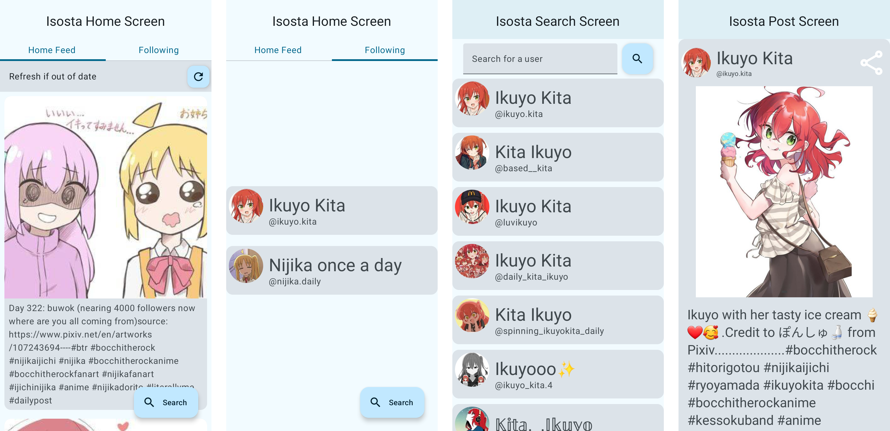

# Isosta
 

Anonymous Instagram viewer for Android, powered by [Imginn](https://imginn.com) (previously picuki.me).

## Screenshots

Screen recording in `./assets/screenrecording.mp4`

## Installation
Visit the [releases page](https://github.com/azusalad/Isosta/releases).

## Features
* Browse Instagram anonymously, through [Imginn](https://imginn.com).
* Follow users and receive a home feed of their new posts.

## Limitations
As this app was made mainly for myself, the app focuses mainly on what I would use it for.  These limitations might be solved in the future.

* As this app is based entirely off Imginn, Isosta can only show data that Imginn shows.  Also, if Imginn were to change, Isosta cannot get new content.
* Isosta cannot mass load posts from a single user.  
  * The current intended way to use this app is to view the home feed once every so often, so new posts are not missed.
* Isosta cannot show videos.
* The other tabs on the Imginn user page (stories and tagged) are not available.

## Acknowledgements
* Google Codelabs for teaching Android Basics with Compose.
* Medium articles for help with several things including pagers and Room storage.
  * Article links are commented in the code when referenced.
* Stack Overflow posts for help with things like file storage.
  * Post links are commented in the code when referenced.

## Disclaimer
The developer of this application does not have any affiliation with the content providers available, and this application hosts zero content.
